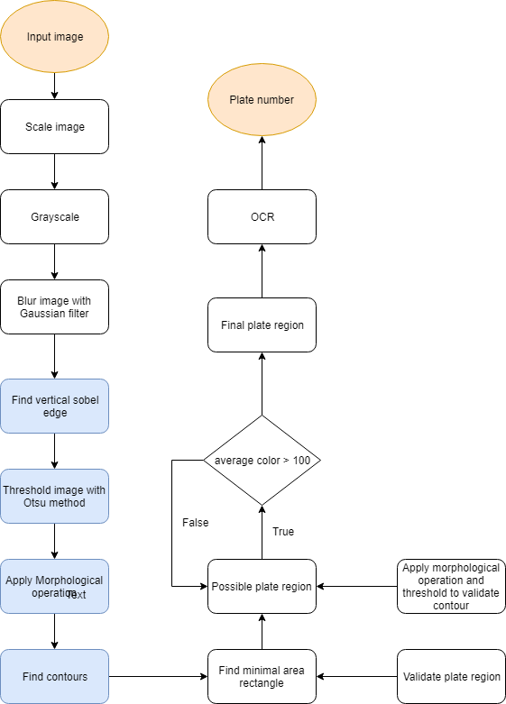
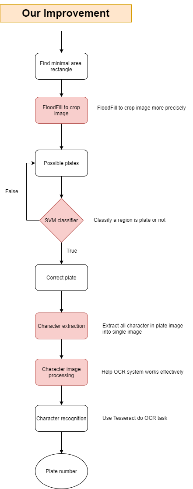
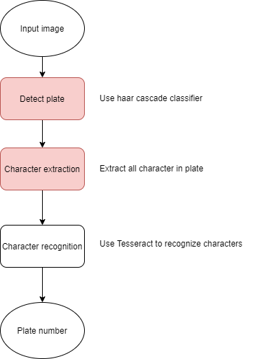

# ALPR-project

## Introduction:
VNUHCM - University of Science

Subject: Introduction to Computer Vision

Final project: Automatic License Plate Recognition (ALPR)

We developed 2 versions:
- Version 1: Process for car plate in Europe. Almost based on handcraft algorithm to segment region in image and then extract license plate region. Also we use SVM classifer to class image as Plate or Not. Finally, we use Tesseract library to recognize plate numbers. But I find Tesseract didn't work well with recognizing each single plate character/number, Tesseract just works well with recognizing semantic sentences. Because it use Long Short-Term Memory (LSTM).
- Version 2: Process for motor plate in Viet Nam. We used transfer learning methods with pretrained model from https://thigiacmaytinh.com/modelcascade-da-huan-luyen/. Particularly, we used Haar-Cascade Classifier rely on Haar features and use it for detecting license plate region.

Those 2 versions don't give the best perfomance comparing with state-of-the-art project in related fields. They are just acceptable results. 

## Team Fusion:
<table>
    <tr>
        <th>StudentID</th>
        <th>Full Name</th>
        <th>Email</th>
    </tr>
    <tr>
        <td>1612174</td>
        <td>Phùng Tiến Hào</td>
        <td><a href="mailto:tienhaophung@gmail.com">tienhaophung@gmail.com</a></td>
    </tr>
    <tr>
        <td>1612269</td>
        <td>Võ Quốc Huy</td>
        <td><a href="mailto:voquochuy304@gmail.com">voquochuy304@gmail.com</a></td>
    </tr>
    <tr>
        <td>1612272</td>
        <td>Trần Nhật Huy</td>
        <td><a href="mailto:nhathuy13598@gmail.com">voquochuy304@gmail.com</a></td>
    </tr>
</table>

## Documents:
There are [proposal](./Reports/proposal.pdf) and [report](./Reports/report.pdf) files that you can refer to. [Slide](.Reports/AUTOMATIC-LICENSE-PLATE-RECOGNITION-ALPR.pptx) is also provided with keynotes. 

Note: These documents were written in Vietnamese.

## System model:
### Version 1: Car plate recognition using Handcraft algorithm 


### Version 2: Motobike plate recognition using Haar-Cascade classifier


## Instructions:
Required libraries:
- OpenCV
- PIL
- Matplotlib
- Numpy
- Pytesseract

### Version 1: Car plate recognition using Handcraft algorithm
```bash
cd "Version 1"
python main.py -i ./Datasets/car_plate_test_01/IMG_0378.jpg \
               -o 0 \ # dont show step by step of model procedure
```

### Version 2: Motobike plate recognition using Haar-Cascade classifier
```bash
cd "Version 2"
python main.py -i ./Datasets/Bike_back/2.jpg
```

## Evaluation:
Handcraft algorithm works well in general cases but our system might fail to detect plate precisely because of noise background, scale (too big/small), light (dazzing or too dark).

Haarcascade classifier is a good detector because it can detect correctly most cases which markedly works even in any scale. However, the bounding box was generated by Haarcascade which are quite big compared with Handcraft algorithm. In general, its perfomance still better than handcraft algorithm. Recently, Haarcascade is not as strong as YOLO. We intend to use YOLO with moto dataset but at last we dont have enough time to handle it in the scope of project. So we just utilize pretrained Haar-Cascade model as out plate detector.

> More details, please check [Documents](##Documents).


